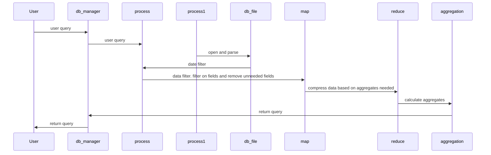
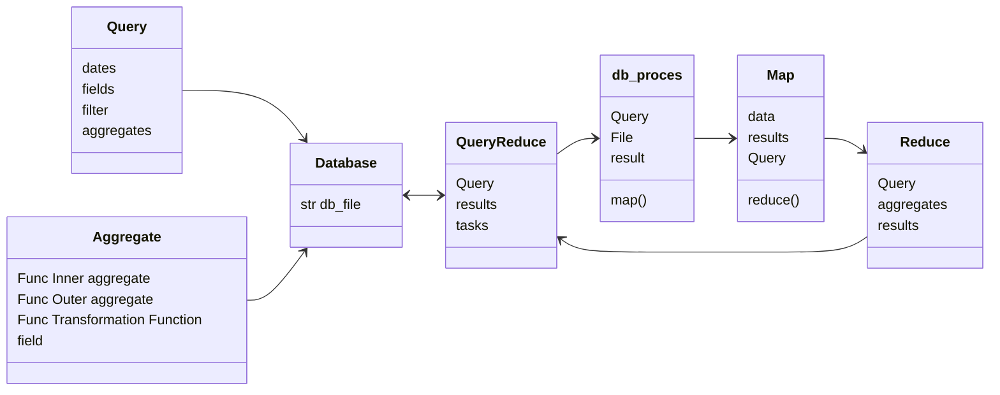

# database Structure

I spent a day looking at different ways I could store data and at the possible ways I could
create faster reads and write. The truth is that msgpack is seriously fast in the first place
so reading and writing to disk is not an issue. 

I then stated to look at how I would index the data for faster queries and decided to force an 
index based on dates. So we have index level 1 year, level2 month level 3 day, then a list of 
records in that section. Unlike a normal database it means no accessing via the id number of
a record, but I can't see why we would want to do that. This is not a transaction database, but
a history database. We might want to run a query that will delete or remove records based
on a query, or add new records, but these will be added into the date structure, thus all
records in the system are meant to be historical and querying by date is required.

I can't think of a way that records needed for analysis would not be saved with timestamps and
extracted for that very reason. Using the hadoop type structure it means that we pull records
by date and then loop through those records to filter (map) and then apply aggregates (reduce).

So following this.

## Database manager.

This is going to point at the primary database file. When a query is passed it will
start an asyncio process for each file in the database

## Process

This will open the file and extract the records based on the date filters

## Map

This will filter the records on the where statements or similar. It will also 
remove all the unneeded fields

## Reduce

This will format the records using a Group By type action. the query will have stated
the primary fields and the reduce will find all records where those fields are the same and
compress the records so the rest of the fields are in lists

## Merge and reduce

Takes the inputs from all reduce processes and creates a single query

## Aggregates

This takes the query data replaces the relevant fields with the aggregates

## Calculating aggregates

Aggregates can be calcuated in the smaller processed and then merged, but they are basically
functions. There will be a function for the small process agregation and a merged function
for the final value.

Stating a aggregate, states the value that is saved in the map function, and then reduced to a list
in the reduce function. so if we wanted the average username length it would have to be
something like average(username, length) where the second argument is a function the field
is passed to to produce a value in map and placed in the list for reduce.

using this, users could create their own aggregation functions. They need to provide an 
inner and outer function, plus a transformation function on the field if needed

